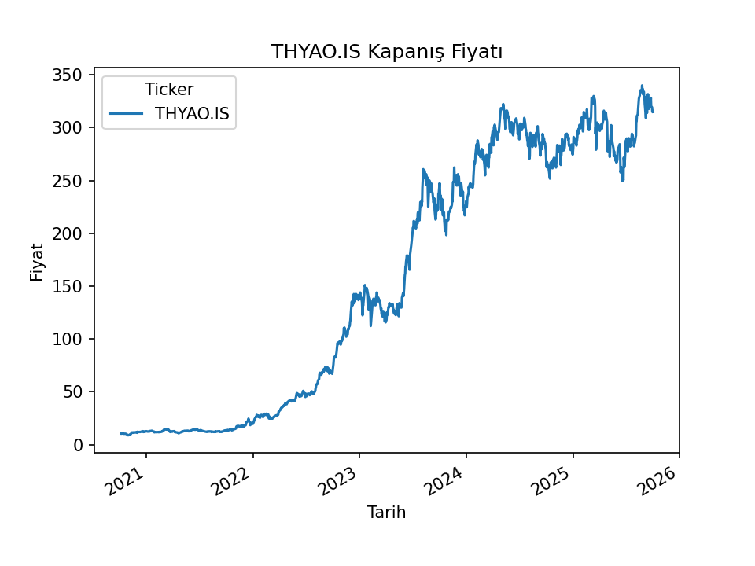
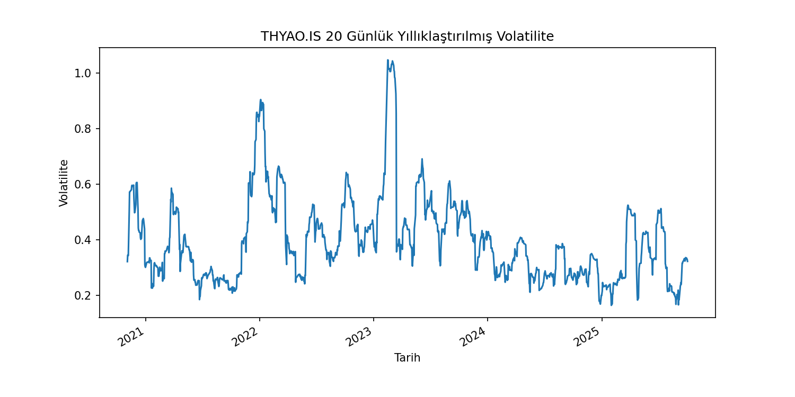
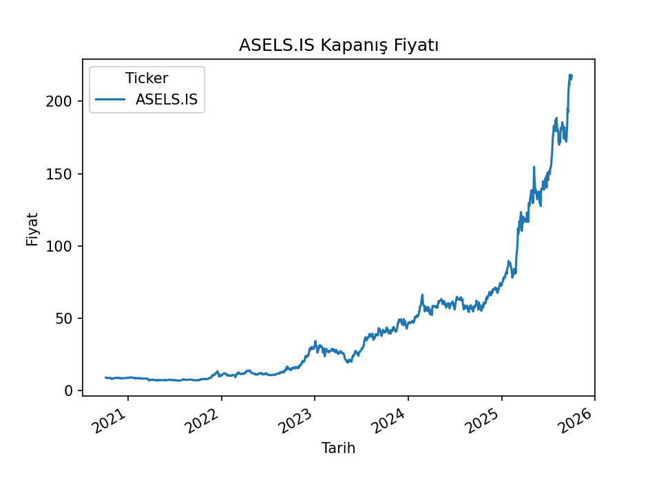
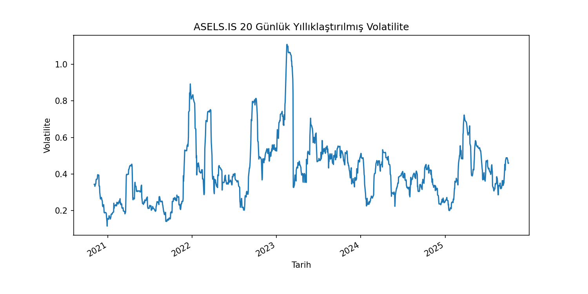
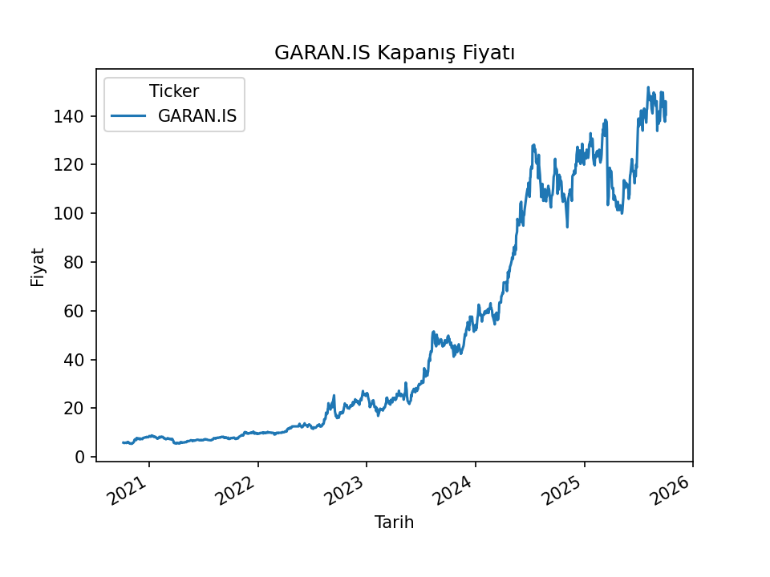
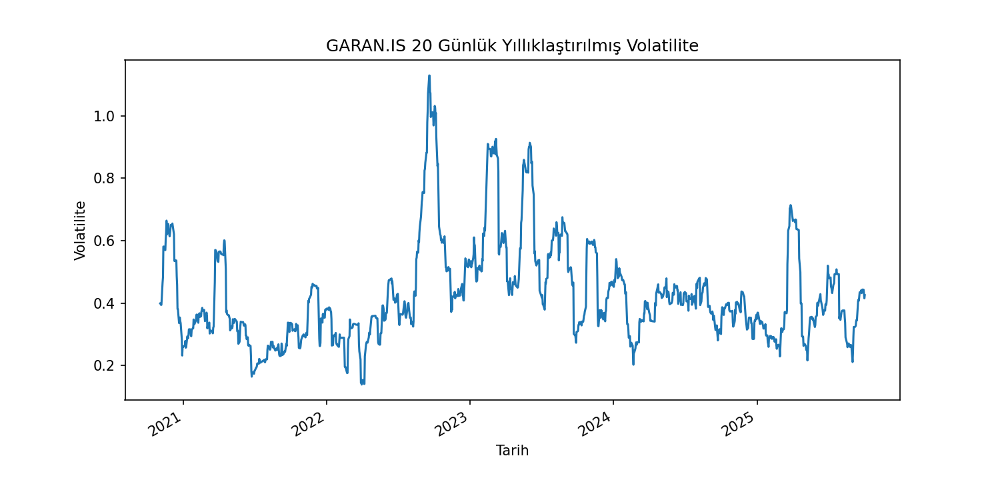
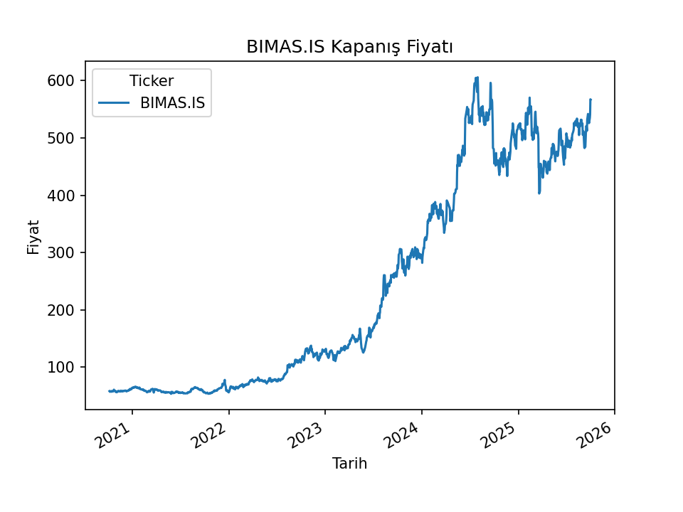
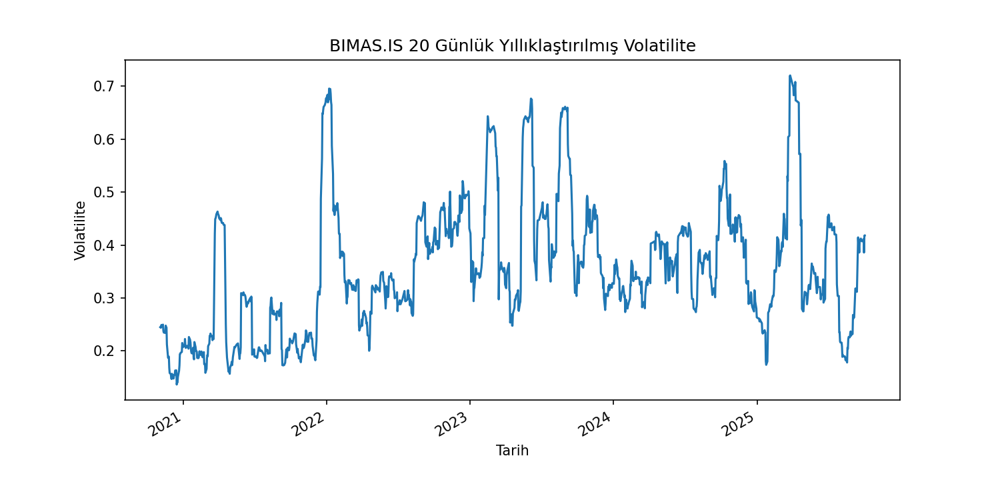

# 📊 Hisse Senedi Analizi 
Bu proje, Borsa İstanbul (BIST) hisseleri için *Python ile veri toplama, analiz etme ve görselleştirme* örneği sunar.  

---

## 🚀 Kullanılan Teknolojiler
- [Python](https://www.python.org/)  
- [pandas](https://pandas.pydata.org/)  
- [yfinance](https://pypi.org/project/yfinance/)  
- [matplotlib](https://matplotlib.org/)

---

## 📊 Özellikler
- Yahoo Finance üzerinden veri toplama  
- Kapanış fiyatı grafiği  
- Günlük getiri hesaplama ve grafiği  
- 20 ve 50 günlük hareketli ortalamalar (SMA)  
- 20 günlük yıllıklaştırılmış volatilite grafiği  
- Otomatik özet raporu (SUMMARY.md) oluşturma

---

## 📂 Proje Yapısı

Projemin klasör düzeni şu şekilde:

- *data/* → Hisse senedi verilerinin CSV dosyaları burada saklanıyor.  
- *figures/* → Grafikleri burada bulabilirsiniz (kapanış fiyatı, günlük getiriler, SMA, volatilite).  
- *data_fetch_and_eda.py* → Tüm işlemleri yapan Python dosyası.  
- *SUMMARY.md* → Programın otomatik oluşturduğu özet rapor (istatistikler + analiz). 
- README.md → Projenin açıklama dosyası 

---

## ⚙️ Çalıştırma

Önce gerekli kütüphaneleri kurun:
```bash
python -m pip install yfinance pandas matplotlib 
```
Ardından çalıştırın (varsayılan sembol THYAO.IS)
```bash
python data_fetch_and_eda.py 
```

---

## 🔧 Kullanım Örnekleri

Başka bir hisseyi analiz etmek için komut satırında sembol girin:
### ASELS için 
python data_fetch_and_eda.py ASELS

### GARAN için 
python data_fetch_and_eda.py GARAN.IS

### BIMAS için 
python data_fetch_and_eda.py BIMAS

Çalıştırdıktan sonra:
	•	data/ klasörüne CSV dosyası kaydedilir
	•	figures/ klasörüne grafikler kaydedilir
	•	SUMMARY.md dosyasında özet rapor güncellenir


## 📊 Örnek Sonuçlar ve Görseller

### THYAO
| Kapanış Fiyatı | Volatilite |
| --- | --- |
|  |  |

---

### ASELS
| Kapanış Fiyatı | Volatilite |
| --- | --- |
|  |  |

---

### GARAN
| Kapanış Fiyatı | Volatilite |
| --- | --- |
|  |  |

---

### BIMAS
| Kapanış Fiyatı | Volatilite |
| --- | --- |
|  |  |

## 📝 Notlar

	•	Varsayılan sembol THYAO.IS / Kod kolayca diğer hisseler için de kullanılabilir:(python data_fetch_and_eda.py ASELS) 
    •   .IS uzantısını yazmasanız da otomatik eklenir (örn: ASELS → ASELS.IS)
	•	Grafikler figures/ klasörüne kaydedilir.
	•	Özet rapor SUMMARY.md dosyasında bulunur. 


## 📌 Sonuçlar  

Bu proje kapsamında Borsa İstanbul (BIST) hisselerinin geçmiş fiyat verileri analiz edilmiştir.  
Kapanış fiyatı ve volatilite grafiklerinden, hisse senetlerinin fiyat trendleri ve oynaklıkları gözlemlenmiştir.  

- 📈 **Kapanış fiyatı grafikleri**, hisselerin uzun vadeli fiyat hareketlerini ortaya koyar.  
- 📊 **Volatilite grafikleri**, fiyatlardaki dalgalanma seviyesini gösterir.  

Bu proje, temel veri analizi ve görselleştirme tekniklerini öğrenmek isteyenler için bir örnek niteliği taşımaktadır.  
Elde edilen çıktılar, yatırım kararları için doğrudan öneri değildir; yalnızca **eğitim ve analiz amaçlıdır**.
